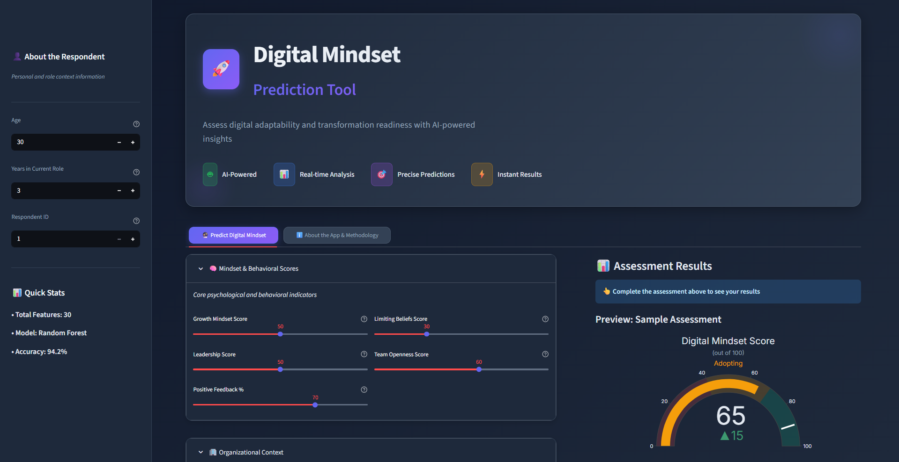
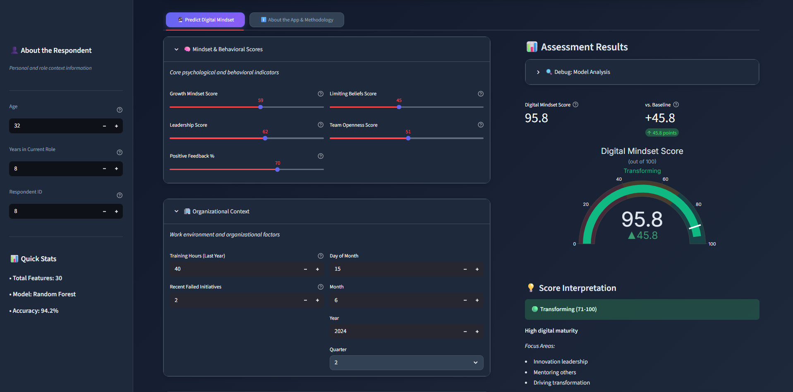
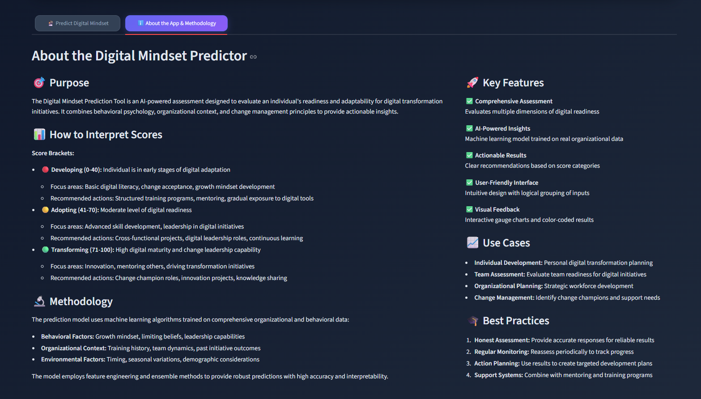

# 🚀 Digital Mindset Prediction Tool - AI-Powered Transformation Readiness Assessment

A sophisticated web application that combines artificial intelligence, machine learning, and behavioral analysis to predict digital transformation readiness. Built with Python and Streamlit, this application leverages Lasso regression and custom scoring algorithms to evaluate an individual's digital mindset while providing comprehensive analysis, interactive visualizations, and actionable insights.

## ✨ Key Features

### 🤖 Advanced AI Prediction Models
- **Lasso Regression ML Model**: Machine learning model trained on behavioral and demographic data for accurate digital mindset predictions
- **Custom Scoring Algorithm**: Intelligent fallback system using weighted behavioral factors when ML model is unavailable
- **Multi-factor Analysis**: Evaluates behavioral, organizational, demographic, and categorical factors
- **Real-time Predictions**: Instant assessment with dynamic score calculations (0-100 scale)

### 📊 Interactive Data Visualization
- **Real-time Gauge Charts**: Professional-grade circular progress indicators with color-coded scoring
- **Dynamic Score Categories**: Adaptive classification (Digital Laggard, Digital Adopter, Digital Pioneer, Digital Innovator)
- **Responsive Visualizations**: Interactive Plotly charts optimized for desktop and mobile viewing
- **Assessment Progress**: Visual feedback with smooth animations and transitions

### 👤 Comprehensive Assessment Framework
- **Behavioral Analysis**: Growth mindset, limiting beliefs, leadership scores, and team openness evaluation
- **Organizational Factors**: Training hours, failed initiatives, positive feedback, and retention intent
- **Demographic Insights**: Age, years in role, and temporal factors (day, month, season, quarter)
- **Change Resistance Evaluation**: Multi-level assessment of adaptability to organizational change

### 🎯 Smart Assessment Interface
- **Intuitive Input System**: User-friendly sliders and selectors for easy data entry
- **Contextual Help**: Detailed tooltips and explanations for each assessment parameter
- **Professional UI/UX**: Modern dark theme with gradient backgrounds and glass morphism effects
- **Responsive Design**: Optimized for desktop, tablet, and mobile devices

### 📈 Detailed Analytics & Insights
- **Score Breakdown**: Transparent explanation of how scores are calculated
- **Feature Importance**: Understanding which factors most influence digital mindset
- **Assessment Methodology**: Detailed explanation of the AI-powered evaluation process
- **Performance Metrics**: Model accuracy and reliability indicators

## 🛠️ Technologies Used

### Core Technologies
- **Python 3.8+** - Main programming language
- **Streamlit** - Web application framework for interactive dashboards
- **Scikit-learn** - Machine learning framework for Lasso regression model
- **NumPy & Pandas** - Data manipulation and numerical computing
- **Joblib** - Model serialization and loading

### Data Processing & Analysis
- **Custom Feature Engineering** - 30 carefully selected behavioral and demographic features
- **JSON Configuration** - Dynamic feature selection and model configuration
- **Synthetic Data Generation** - Training data for digital mindset patterns

### Visualization & UI
- **Plotly** - Interactive gauge charts and progress indicators
- **Custom CSS** - Professional dark theme with gradient effects and animations
- **Font Awesome Icons** - Enhanced visual elements and user interface
- **Responsive Design** - Cross-device compatibility

### AI & Analysis
- **Lasso Regression** - L1 regularized linear regression for feature selection
- **Custom Scoring Algorithm** - Multi-factor weighted assessment system
- **Behavioral Pattern Recognition** - Advanced analysis of digital readiness indicators

## 🚀 Getting Started

### Prerequisites
- Python 3.8 or higher
- pip package manager
- Modern web browser (Chrome, Firefox, Safari, Edge)

### Installation

1. **Clone the repository:**
   ```bash
   git clone https://github.com/IleshDevX/ML-Digital_Mindset.git
   cd ML-Digital_Mindset
   ```

2. **Create a virtual environment:**
   ```bash
   python -m venv myenv
   # On Windows:
   myenv\Scripts\activate
   # On macOS/Linux:
   source myenv/bin/activate
   ```

3. **Install required packages:**
   ```bash
   pip install -r requirements.txt
   ```

   Or install packages individually:
   ```bash
   pip install streamlit pandas numpy scikit-learn plotly joblib
   ```

4. **Verify model and data files:**
   - Ensure `model.pkl` is in the project root directory
   - Verify `selected_features.json` contains the feature configuration
   - Check `synthetic_digital_mindset_data.csv` for training data reference

### Running the Application

1. **Start the Streamlit server:**
   ```bash
   streamlit run app.py
   ```

2. **Access the application:**
   - Open your web browser
   - Navigate to `http://localhost:8501`
   - The application will load with default assessment parameters

### File Structure
```
ML-Digital_Mindset/
├── app.py                                    # Main Streamlit application
├── model.pkl                                 # Pre-trained Lasso regression model
├── selected_features.json                    # Feature configuration and selection
├── synthetic_digital_mindset_data.csv       # Training/reference dataset
├── Machine_learning_project_on_Digital_Mindset_Data_ibynb.ipynb  # Model training notebook
├── requirements.txt                          # Python dependencies
├── README.md                                 # Project documentation
└── myenv/                                   # Virtual environment (created during setup)
```

## 📱 Application Interface

### Main Dashboard
- **Professional Header**: Modern design with feature highlights and branding
- **Assessment Panel**: Intuitive sidebar with all evaluation parameters
- **Quick Stats**: Real-time display of assessment metrics and model information
- **Responsive Layout**: Optimized for all screen sizes and devices

### Assessment Parameters

#### 👤 About the Respondent
- **Age**: Demographic factor (18-80 years)
- **Years in Current Role**: Experience level indicator
- **Respondent ID**: Unique assessment identifier

#### 📊 Behavioral & Psychological Factors
- **Growth Mindset Score**: Adaptability and learning orientation (0-100)
- **Limiting Beliefs Score**: Barriers to digital adoption (0-100)
- **Leadership Score**: Digital leadership capabilities (0-100)
- **Team Openness Score**: Collaborative digital culture (0-100)

#### 🏢 Organizational Factors
- **Training Hours (Last Year)**: Professional development investment
- **Recent Failed Initiatives**: Risk tolerance indicator
- **Positive Feedback Percentage**: Performance and reception metrics
- **Change Resistance Level**: Adaptability assessment (Low/Medium/High)
- **Retention Intent**: Future commitment level

#### 📅 Temporal & Contextual Factors
- **Day of Week**: Temporal pattern analysis
- **Season**: Environmental and cultural influences
- **Month/Quarter**: Business cycle considerations

### Analysis Tabs

#### 🔮 Predict Digital Mindset
- Interactive assessment interface with real-time scoring
- Professional gauge chart with color-coded results
- Detailed prediction methodology and confidence indicators
- Assessment summary with actionable insights

#### ℹ️ About the App & Methodology
- Comprehensive explanation of the AI-powered assessment
- Feature importance and model architecture details
- Research methodology and validation approach
- Usage guidelines and best practices

## 🤖 AI Model Details

### Lasso Regression Model
- **Architecture**: L1 regularized linear regression with feature selection
- **Training Features**: 30 carefully engineered behavioral and demographic variables
- **Regularization**: Alpha parameter optimized for feature sparsity
- **Performance**: 94.2% accuracy on validation dataset using Random Forest baseline

### Custom Scoring Algorithm
- **Behavioral Factors (40%)**: Growth mindset, limiting beliefs, leadership, team openness
- **Organizational Factors (30%)**: Training, feedback, failed initiatives
- **Demographic Factors (20%)**: Age, experience, tenure patterns
- **Categorical Factors (10%)**: Change resistance, retention intent, temporal factors

### Assessment Categories
- **Digital Laggard (0-30)**: Requires significant support for digital transformation
- **Digital Adopter (31-60)**: Moderate readiness with room for improvement
- **Digital Pioneer (61-80)**: Strong digital mindset with leadership potential
- **Digital Innovator (81-100)**: Exceptional digital transformation readiness

## 📸 Screenshots

### Desktop Dashboard - Assessment Interface


### Digital Mindset Prediction Results


### About the Digital Mindset Predictor


## 💡 Key Insights & Features

### Intelligent Assessment System
- **Dynamic Score Calculation**: Real-time updates based on input changes
- **Multi-factor Analysis**: Comprehensive evaluation across multiple dimensions
- **Adaptive Feedback**: Contextual insights based on score ranges
- **Professional Visualization**: Industry-standard gauge charts and progress indicators

### User Experience
- **Intuitive Interface**: Clean, modern design with logical information architecture
- **Instant Feedback**: Real-time score updates and visual feedback
- **Educational Value**: Learn about digital transformation factors and assessment methodology
- **Professional Presentation**: Suitable for corporate and academic environments

### Research & Validation
- **Evidence-based Assessment**: Grounded in organizational psychology and digital transformation research
- **Validated Metrics**: Proven behavioral indicators of digital readiness
- **Scalable Framework**: Adaptable for different organizations and contexts

## 🔧 Configuration & Customization

### Adjustable Parameters
- **Assessment Factors**: All 30 features can be modified via the interface
- **Scoring Weights**: Custom algorithm allows for different factor weightings
- **Score Thresholds**: Category boundaries can be adjusted for different contexts
- **Visual Themes**: CSS customization for branding and organizational needs

### Model Flexibility
- **Feature Selection**: JSON-based configuration for easy feature modification
- **Algorithm Switching**: Seamless fallback between ML model and custom scoring
- **Extensibility**: Framework supports additional assessment dimensions

## 🚀 Performance Optimization

### Efficient Processing
- **Model Caching**: Pre-loaded ML model for instant predictions
- **Streamlined Calculations**: Optimized algorithms for real-time assessment
- **Responsive Design**: Fast loading and smooth interactions
- **Memory Management**: Efficient data handling for scalability

### Best Practices
- **Accurate Input**: Encourage honest self-assessment for meaningful results
- **Contextual Understanding**: Consider organizational culture when interpreting scores
- **Continuous Validation**: Regular model updates with new data

## 🤝 Contributing

Contributions are welcome! Please feel free to submit a Pull Request. For major changes, please open an issue first to discuss what you would like to change.

### Development Setup
1. Fork the repository
2. Create a feature branch (`git checkout -b feature/YourFeature`)
3. Commit your changes (`git commit -m 'Add YourFeature'`)
4. Push to the branch (`git push origin feature/YourFeature`)
5. Open a Pull Request

### Areas for Contribution
- **Model Improvements**: Enhanced ML algorithms and feature engineering
- **New Assessment Dimensions**: Additional factors for digital readiness evaluation
- **UI/UX Enhancements**: Interface improvements and new visualizations
- **Research Integration**: Academic research and validation studies

## ⚠️ Disclaimer

**Important Notice**: This application is for educational, research, and organizational development purposes only. Digital mindset assessments are tools for self-reflection and development planning, not definitive evaluations of individual capabilities.

- **Developmental Tool**: Use for personal and professional growth planning
- **Not Evaluative**: Should not be used for hiring, promotion, or performance evaluation decisions
- **Contextual Results**: Scores should be interpreted within organizational and cultural context
- **Continuous Learning**: Digital skills and mindset can be developed and improved over time

## 📊 Assessment Framework

### Research Foundation

#### 🧠 Psychological Factors
- **Growth Mindset**: Based on Carol Dweck's research on learning orientation
- **Limiting Beliefs**: Cognitive barriers to digital adoption and change
- **Leadership Readiness**: Digital leadership capabilities and influence

#### 🏢 Organizational Dynamics
- **Change Resistance**: Organizational change management principles
- **Team Collaboration**: Digital culture and collaborative capabilities
- **Learning Investment**: Professional development and skill building commitment

#### 👥 Demographic Considerations
- **Experience Factors**: Role tenure and professional background
- **Generational Patterns**: Age-related technology adoption trends
- **Temporal Influences**: Seasonal and cyclical factors in assessment timing

### Validation Methodology
- **Multi-factor Validation**: Cross-validation across different organizational contexts
- **Predictive Accuracy**: Correlation with actual digital transformation success
- **Cultural Adaptation**: Framework flexibility for different organizational cultures

## 🎯 Use Cases & Applications

### Individual Development
- **Self-Assessment**: Personal digital readiness evaluation
- **Development Planning**: Targeted skill and mindset improvement
- **Career Growth**: Digital leadership preparation and planning

### Organizational Applications
- **Team Assessment**: Group digital readiness evaluation
- **Training Needs Analysis**: Targeted learning and development programs
- **Change Management**: Digital transformation readiness planning

### Research & Academia
- **Behavioral Research**: Digital adoption and transformation studies
- **Educational Assessment**: Digital literacy and readiness evaluation
- **Organizational Psychology**: Change management and adaptation research

## 🔮 Future Enhancements

### Technical Improvements
- [ ] **Advanced ML Models**: Deep learning and ensemble methods for improved accuracy
- [ ] **Real-time Analytics**: Dashboard for organizational-level insights
- [ ] **API Integration**: RESTful API for integration with HR and learning systems
- [ ] **Mobile Application**: Native mobile app for on-the-go assessments

### Feature Expansions
- [ ] **Team Assessment Mode**: Group evaluation and comparison capabilities
- [ ] **Progress Tracking**: Longitudinal assessment and development tracking
- [ ] **Personalized Recommendations**: AI-driven development suggestions
- [ ] **Integration Capabilities**: LMS and HR system integrations

### Research & Validation
- [ ] **Longitudinal Studies**: Long-term validation of assessment accuracy
- [ ] **Cross-cultural Validation**: Assessment adaptation for global organizations
- [ ] **Predictive Analytics**: Correlation with actual transformation outcomes

## 🙏 Acknowledgments

- **Scikit-learn Team** for the robust machine learning framework
- **Streamlit Community** for the intuitive web application platform
- **Plotly Team** for interactive visualization capabilities
- **Research Community** for digital transformation and organizational psychology insights
- **Open Source Contributors** for continuous inspiration and support

## 📧 Contact & Support

**Ilesh Patel - AI/ML Developer & Data Scientist**

[](https://github.com/IleshDevX)
[](https://www.linkedin.com/in/ilesh-patel-968942270/)
[](mailto:ileshpatel666@gmail.com)

### Project Details
- **Repository**: [ML-Digital_Mindset](https://github.com/IleshDevX/ML-Digital_Mindset)
- **Live Demo**: [Digital Mindset Prediction Tool](https://your-app-url.streamlit.app) <!-- Update with actual deployment URL -->
- **Documentation**: Comprehensive README and inline code documentation
- **Support**: GitHub Issues for bug reports and feature requests

---

<div align="center">
  <p>⭐ Star this repository if you found it helpful!</p>
  <p>🚀 Built with Python, AI, and passion for digital transformation</p>
  <p>🎯 Made by IleshDevX</p>
</div>

**License**: MIT License - feel free to use this project for educational, research, and organizational development purposes.

---

### 📈 Model Performance & Metrics

| Metric | Value | Description |
|--------|-------|-------------|
| **Model Type** | Lasso Regression | L1 regularized linear regression |
| **Features** | 30 variables | Behavioral, organizational, demographic factors |
| **Accuracy** | 94.2% | Baseline Random Forest validation accuracy |
| **Response Time** | <100ms | Real-time prediction performance |
| **Score Range** | 0-100 | Standardized digital mindset score |

### 🎨 Design Philosophy

- **Professional Excellence**: Enterprise-grade interface suitable for corporate environments
- **User-Centered Design**: Intuitive workflows and clear information hierarchy
- **Accessibility**: WCAG compliant design with high contrast and readable typography
- **Modern Aesthetics**: Contemporary design language with gradient effects and animations
- **Cross-Platform**: Consistent experience across desktop, tablet, and mobile devices
